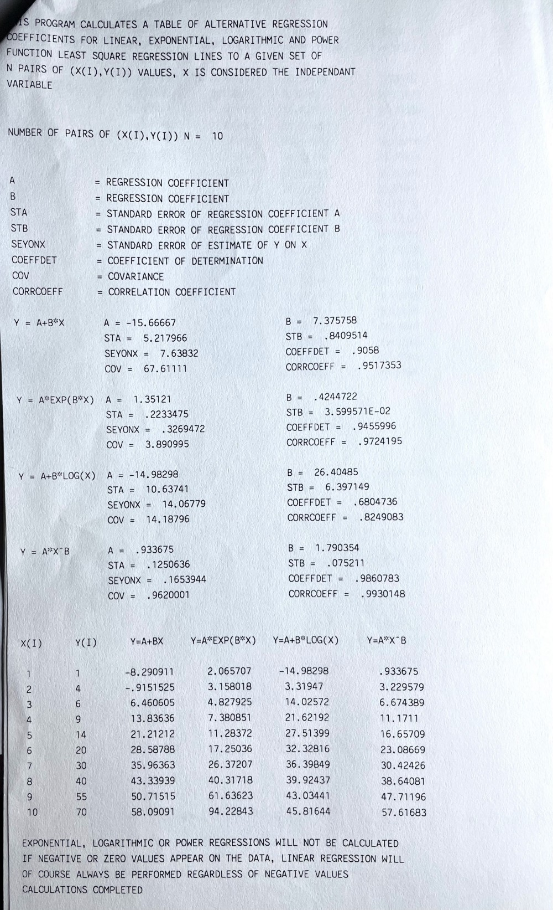
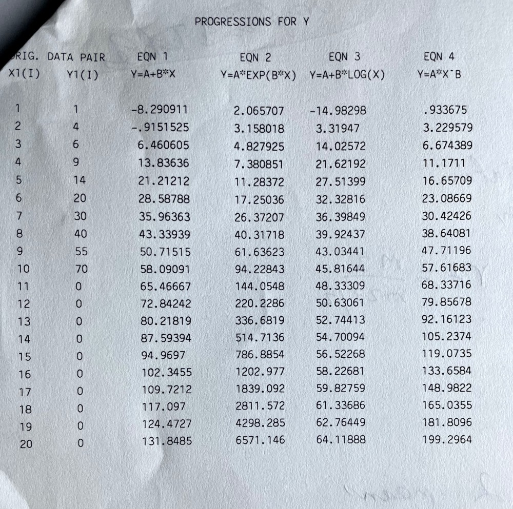

# One Independent Variable Regression calculator in Quick Basic
# 
# Background
This is my second software application I ever wrote for work (my fisrt being an HP41CV calculator app in the 1980's). It was written in 1991 using my own private copy of Microsoft Quick Basic at the request of a statistician (who was my boss). It was used to demonstrate what a personal computer could do back then, when these had only started to appear recently, and our branch in Cape Town had no programmers at all. My boss gave me some papers with the background about OIVR, some test data, etc and off I went and wrote something.

For just over a year I improved this application. It is always best to learn programming with some real world problem to solve. I also rewrote this application in a number of other languages I learnt later (see my other repo for a version in C++). Back then too, there was no Internet or Google Search, so what I learnt, I learnt from books I bought (still have them actually).

The application also served to demonstrate that PC applications could be developed in regional branches, and we became the first branch, outside of our head office, to develop applications. Officially we used Clipper 5.3 (similar to DBase).

# Screenshots
These are from original test printouts in 1993.

# From Orginal Instructions:
This program allows input of pairs of data (up to 200) and will then calculate a table of alternative regression coefficients for linear, exponential, logarithmic and power function least square lines to a given set of N pairs (the data you entered).  What this boils down to is that it will try and fit one of the 4 types of curve to your data.  This curve can then be used to calculate further progressions, standard error of estimate, etc.

It calculates Regression coefficient for A and B, Standard Error of Regression for coefficient A and B, Standard Error of Estimate of Y on X, Coefficient of Determination, Covariance and Correlation Coefficient for each type of Regression.

## INSTRUCTIONS:
Make sure your printer is switched on.  If you don't the program will stop and prompt you to switch it on.

Command line options are:
OIVR to execute the program
OIVR /? for help
OIVR /SETUP to rest your user colours and monitor type. No colour 	choice with a hercules monochrome monitor.

When starting the program it will check your setup file.  If there is no setup file it will create one and ask for monitor type and colour settings if applicable (at present it defaults to monochrome unless you run SETUP - something happened here!).  If there is a setup file it will straightaway display the relevant title screen and proceed with the rest of the program.

The following prompt is for a title for your task, if any.  It will then ask for the number of pairs to be input.  For this type of input (or where the cursor is present) you must press ENTER to continue.

It will ask whether you would like to import from a data file.  This could be a file that was previously saved or that was exported from another program such as Q&A.  The format of this file is an ASCII file containing number single numeric fields without delimiters or quotation marks, one per line.  These values will be imported as the Y1 value with the X1 value starting at 1 and ending with the nth Y1 value.

If data was not imported then it will then prompt for the number of pairs to be entered.  It then prompts for the first data pair.  Enter the x and y value with a comma between, eg. 1,34.  These are floating point numbers and decimal points can be used in them.  The pair number is displayed next each pair.  If a mistake is made note the pair number.

After the data is entered you will be asked if you made any mistakes.  If so enter Y and enter the pair number to correct.  At present version 2.4 limits you to the pairs entered and will not allow additional pairs.

You are then asked whether you would like to save the Y1 values to a disk file.  This enables you to retrieve it again or import it into some other program.

The calculations are then performed and the results are output to the printer.  Check the CORRCOEFF value for each equation.  The value closest to +1 or -1 is the equation closest to the data.  Ideally it should be >.8 or <-.8 .  If it is closer to 0 then the data varies a lot from the curve of the equation.

The program will then prompt if progressions are required.  Progressions should only be performed on a time series and it should start with the value 1 otherwise unpredictable results could occur.  Data can be projected for further values based on one of the equations.  It will ask for how many further values to project.  Enter the number and ENTER.  It will then print progressions for all four equations as well as original values to the printer.  The program will also calculate the best fit equation by the method described in the above paragraph, and print it out to the printer.  It will also describe how closely the equation fits the curve.

The program then prompts for export to an ASCII file.  This option is intended to create a delimited ASCII file which can have its data read into Harvard Graphics.  There are two choices:  1) all the equations can be sent to file with progressions or 2) one particular equation based on the closest fitting curve can be sent to a particular series in Harvard Graphics.  It will also ask which series on Harvard you want to display data in.

There is an option to enter new data once this is all completed.

## IMPORTING INTO HARVARD GRAPHICS
First create a Bar/Line chart.  Then choose IMPORT, DELIMITED ASCII FILE.  Choose the file.  Don't alter any of the Quotation symbols or Delimiter options.  Where it prompts to import a heading select NO.  The data should now be imported.

## EXPORTING FROM Q&A
Only the field containing the Y1 series should be exported as OIVR only reads the first field exported.

In Q&A select "Export Data" and "Standard ASCII".  Enter the name of the Q&A database file to export from.  Enter the path and file name for the text file to export to.

When prompted for retrieve specs F10 can be pressed for all records or export can be limited to a particular district, etc.  For Merge specs type a "1" next to the field containing the Y1 values to be exported.

The next screen prompts for the ASCII file details.  Set Quotes to No, Field Delimiter to Space and Export field Template to No.

The resultant file should contain a single column of numbers without any quotes or commas.
